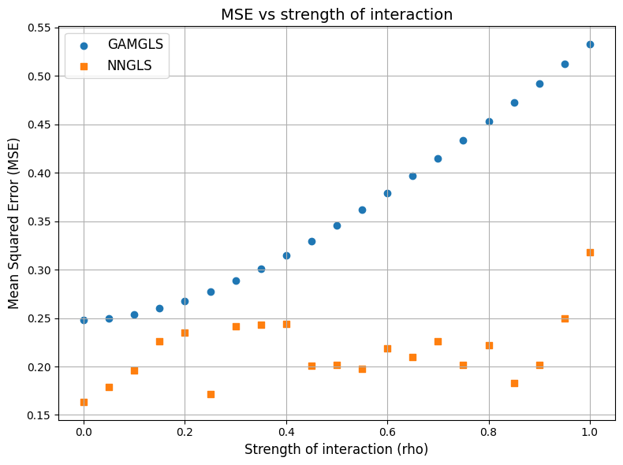

```python
import torch
import geospaNN
import numpy as np
import time
import pandas as pd
import seaborn as sns
import scipy
import lhsmdu
import random

import matplotlib
import matplotlib.pyplot as plt

path = '../data/Output/'
```

    R[write to console]: Loading required package: BRISC
    
    R[write to console]: Loading required package: RANN
    
    R[write to console]: Loading required package: parallel
    
    R[write to console]: Loading required package: rdist
    
    R[write to console]: Loading required package: matrixStats
    
    R[write to console]: Loading required package: pbapply
    
    R[write to console]: The ordering of inputs x (covariates) and y (response) in BRISC_estimation has been changed BRISC 1.0.0 onwards.
      Please check the new documentation with ?BRISC_estimation.
    


    R package: BRISC installed


    /Users/zhanwentao/opt/anaconda3/envs/NN/lib/python3.10/site-packages/pandas/core/arrays/masked.py:60: UserWarning: Pandas requires version '1.3.6' or newer of 'bottleneck' (version '1.3.5' currently installed).
      from pandas.core import (


```python
def RMSE(x,y):
    x = x.reshape(-1)
    y = y.reshape(-1)
    n = x.shape[0]
    return(np.sqrt(np.sum(np.square(x-y))/n))

def f5(X): return (10 * np.sin(np.pi * X[:, 0] * X[:, 1]) + 20 * (X[:, 2] - 0.5) ** 2 + 10 * X[:, 3] + 5 * X[:, 4]) / 6

sigma = 1
phi = 3
Lambda = 0.01
theta = torch.tensor([sigma, phi / np.sqrt(2), Lambda])

p = 5;
funXY = f5

n = 1000
nn = 20
batch_size = 50

N = 1000
n_small = int(N / 100)
np.random.seed(2021)
X_MISE = np.array(lhsmdu.sample(p, n_small).reshape((n_small, p)))
for i in range(99):
    temp = np.array(lhsmdu.sample(p, n_small).reshape((n_small, p)))
    X_MISE = np.concatenate((X_MISE, temp))

X_MISE_torch = torch.from_numpy(X_MISE).float()
```


```python
torch.manual_seed(2025)
X, Y, coord, cov, corerr = geospaNN.Simulation(n, p, nn, funXY, theta, range=[0, 10])

X, Y, coord, _ = geospaNN.spatial_order(X, Y, coord, method='max-min')
data = geospaNN.make_graph(X, Y, coord, nn)

torch.manual_seed(2025)
np.random.seed(0)
data_train, data_val, data_test = geospaNN.split_data(X, Y, coord, neighbor_size=nn,
                                                      test_proportion=0.2)
```


```python
import utils_pygam
```


```python
torch.manual_seed(2024)
mlp_nn = torch.nn.Sequential(
    torch.nn.Linear(p, 50),
    torch.nn.ReLU(),
    torch.nn.Linear(50, 1)
)
nn_model = geospaNN.nn_train(mlp_nn, lr=0.01, min_delta=0.001)
training_log = nn_model.train(data_train, data_val, data_test, seed = 2024)
theta0 = geospaNN.theta_update(mlp_nn(data_train.x).squeeze() - data_train.y,data_train.pos, neighbor_size=20)
```

    Epoch 00089: reducing learning rate of group 0 to 5.0000e-03.
    INFO: Early stopping
    End at epoch92
    ---------------------------------------- 
    	Ordering Coordinates 
    ----------------------------------------
    	Model description
    ----------------------------------------
    BRISC model fit with 600 observations.
    
    Number of covariates 1 (including intercept if specified).
    
    Using the exponential spatial correlation model.
    
    Using 15 nearest neighbors.
    
    
    
    Source not compiled with OpenMP support.
    ----------------------------------------
    	Building neighbor index
    ----------------------------------------
    	Performing optimization
    ----------------------------------------
    	Processing optimizers
    ----------------------------------------
    Theta estimated as
    [0.88725394 2.87048584 0.04966461]


```python
Est_NN = mlp_nn(X_MISE_torch).detach().numpy()
RMSE(Est_NN, funXY(X_MISE))
```


    0.3801058505234924


```python
torch.manual_seed(2024)
mlp_nngls = torch.nn.Sequential(
    torch.nn.Linear(p, 50),
    torch.nn.ReLU(),
    torch.nn.Linear(50, 20),
    torch.nn.ReLU(),
    torch.nn.Linear(20, 1)
)
model_nngls = geospaNN.nngls(p=p, neighbor_size=nn, coord_dimensions=2, mlp=mlp_nngls, theta=torch.tensor(theta0))
nngls_model = geospaNN.nngls_train(model_nngls, lr=0.01, min_delta=0.001)
training_log = nngls_model.train(data_train, data_val, data_test,
                                 Update_init=20, Update_step=10, seed = 2024)
```

    ---------------------------------------- 
    	Ordering Coordinates 
    ----------------------------------------
    	Model description
    ----------------------------------------
    BRISC model fit with 600 observations.
    
    Number of covariates 1 (including intercept if specified).
    
    Using the exponential spatial correlation model.
    
    Using 15 nearest neighbors.
    
    
    
    Source not compiled with OpenMP support.
    ----------------------------------------
    	Building neighbor index
    ----------------------------------------
    	Performing optimization
    ----------------------------------------
    	Processing optimizers
    ----------------------------------------
    Theta estimated as
    [0.93411162 2.81610403 0.00887926]
    to
    [0.93411162 2.81610403 0.00887926]
    Epoch 00028: reducing learning rate of group 0 to 5.0000e-03.
    ---------------------------------------- 
    	Ordering Coordinates 
    ----------------------------------------
    	Model description
    ----------------------------------------
    BRISC model fit with 600 observations.
    
    Number of covariates 1 (including intercept if specified).
    
    Using the exponential spatial correlation model.
    
    Using 15 nearest neighbors.
    
    
    
    Source not compiled with OpenMP support.
    ----------------------------------------
    	Building neighbor index
    ----------------------------------------
    	Performing optimization
    ----------------------------------------
    	Processing optimizers
    ----------------------------------------
    Theta estimated as
    [9.40861195e-01 2.77224716e+00 1.00000000e-03]
    to
    [9.40861195e-01 2.77224716e+00 1.00000000e-03]
    ---------------------------------------- 
    	Ordering Coordinates 
    ----------------------------------------
    	Model description
    ----------------------------------------
    BRISC model fit with 600 observations.
    
    Number of covariates 1 (including intercept if specified).
    
    Using the exponential spatial correlation model.
    
    Using 15 nearest neighbors.
    
    
    
    Source not compiled with OpenMP support.
    ----------------------------------------
    	Building neighbor index
    ----------------------------------------
    	Performing optimization
    ----------------------------------------
    	Processing optimizers
    ----------------------------------------
    Theta estimated as
    [9.39615686e-01 2.78437448e+00 1.00000000e-03]
    to
    [9.39615686e-01 2.78437448e+00 1.00000000e-03]
    Epoch 00049: reducing learning rate of group 0 to 2.5000e-03.
    ---------------------------------------- 
    	Ordering Coordinates 
    ----------------------------------------
    	Model description
    ----------------------------------------
    BRISC model fit with 600 observations.
    
    Number of covariates 1 (including intercept if specified).
    
    Using the exponential spatial correlation model.
    
    Using 15 nearest neighbors.
    
    
    
    Source not compiled with OpenMP support.
    ----------------------------------------
    	Building neighbor index
    ----------------------------------------
    	Performing optimization
    ----------------------------------------
    	Processing optimizers
    ----------------------------------------
    Theta estimated as
    [9.38382339e-01 2.74115991e+00 1.00000000e-03]
    to
    [9.38382339e-01 2.74115991e+00 1.00000000e-03]
    INFO: Early stopping
    End at epoch52


```python
Est_NNGLS = mlp_nngls(X_MISE_torch).detach().numpy()
RMSE(Est_NNGLS, funXY(X_MISE))
```


    0.35517833944095023


```python
torch.manual_seed(2024)
np.random.seed(2024)
X_train = data_train.x.detach().numpy()
Y_train = data_train.y.detach().numpy()
gam = utils_pygam.my_LinearGAM()
gam.fit(X_train, Y_train)
Xspline = gam._modelmat(X_train)
gam.my_fit(X_train, Xspline, Y_train)
```

```python
Est_GAM = gam.predict(X_MISE)
RMSE(Est_GAM, funXY(X_MISE))
```


    0.3790614014474388


```python
torch.manual_seed(2024)
np.random.seed(2024)
X_train = data_train.x.detach().numpy()
Y_train = data_train.y.detach().numpy()
gam = utils_pygam.my_LinearGAM()
gam.fit(X_train, Y_train)
Xspline = gam._modelmat(X_train)
I_B_GAM, F_GAM = geospaNN.make_bf(data_train.pos, theta0, nn)
I_B_GAM = I_B_GAM.to_dense()
F_GAM = F_GAM.detach().numpy()
FI_B_GAM = (I_B_GAM.T * np.sqrt(np.reciprocal(F_GAM))).T
gam.my_fit(X_train,
           scipy.sparse.csr_matrix(np.matmul(FI_B_GAM, Xspline.todense())),
           np.array(np.matmul(FI_B_GAM, Y_train)))
```


```python
Est_GAMGLS = gam.predict(X_MISE)
RMSE(Est_GAMGLS, funXY(X_MISE))
```


    0.3538191720461421


```python
rho_vec = []
MSE_GAMGLS = []
MSE_NNGLS = []
for rho in list(np.array(range(21))/20):
    print(rho)
    def f5(X): return rho * (10 * np.sin(np.pi * X[:, 0] * X[:, 1]))/3 + \
                      (1-rho)*(20 * (X[:, 2] - 0.5) ** 2 + 10 * X[:, 3] + 5 * X[:,4]) / 3

    funXY = f5
    torch.manual_seed(2024)
    X, Y, coord, cov, corerr = geospaNN.Simulation(n, p, nn, funXY, theta, range=[0, 10])
    random.seed(2024)
    X, Y, coord, _ = geospaNN.spatial_order(X, Y, coord, method='max-min')
    data = geospaNN.make_graph(X, Y, coord, nn)
    torch.manual_seed(2024)
    np.random.seed(0)
    data_train, data_val, data_test = geospaNN.split_data(X, Y, coord, neighbor_size=nn,
                                                          test_proportion=0.2)
    torch.manual_seed(2024)
    mlp_nngls = torch.nn.Sequential(
        torch.nn.Linear(p, 50),
        torch.nn.ReLU(),
        torch.nn.Linear(50, 20),
        torch.nn.ReLU(),
        torch.nn.Linear(20, 1)
    )
    model_nngls = geospaNN.nngls(p=p, neighbor_size=nn, coord_dimensions=2, mlp=mlp_nngls, theta=torch.tensor(theta0))
    nngls_model = geospaNN.nngls_train(model_nngls, lr=0.02, min_delta=0.001)
    training_log = nngls_model.train(data_train, data_val, data_test,
                                     Update_init=10, Update_step=5, seed = 2024)
    Est_NNGLS = mlp_nngls(X_MISE_torch).detach().numpy()
    MSE_NNGLS.append(RMSE(Est_NNGLS, funXY(X_MISE)))
    
    torch.manual_seed(2024)
    np.random.seed(2024)
    X_train = data_train.x.detach().numpy()
    Y_train = data_train.y.detach().numpy()
    gam = utils_pygam.my_LinearGAM()
    gam.fit(X_train, Y_train)
    Xspline = gam._modelmat(X_train)
    I_B_GAM, F_GAM = geospaNN.make_bf(data_train.pos, theta0, nn)
    I_B_GAM = I_B_GAM.to_dense()
    F_GAM = F_GAM.detach().numpy()
    FI_B_GAM = (I_B_GAM.T * np.sqrt(np.reciprocal(F_GAM))).T
    gam.my_fit(X_train,
               scipy.sparse.csr_matrix(np.matmul(FI_B_GAM, Xspline.todense())),
               np.array(np.matmul(FI_B_GAM, Y_train)))
    
    Est_GAMGLS = gam.predict(X_MISE)
    MSE_GAMGLS.append(RMSE(Est_GAMGLS, funXY(X_MISE)))
    rho_vec.append(rho) 
```

```python
df_MSE = pd.DataFrame(
    {'GAMGLS': np.array(MSE_GAMGLS), 'NNGLS': np.array(MSE_NNGLS), 'rho': np.array(rho_vec)})
```


```python
import pandas as pd
import matplotlib.pyplot as plt

# Plot using Matplotlib
plt.figure(figsize=(8, 6))
plt.scatter(df_MSE['rho'], df_MSE['GAMGLS'], label='GAMGLS', marker='o')
plt.scatter(df_MSE['rho'], df_MSE['NNGLS'], label='NNGLS', marker='s')

# Add titles and labels
plt.title('MSE vs strength of interaction', fontsize=14)
plt.xlabel('Strength of interaction (rho)', fontsize=12)
plt.ylabel('Mean Squared Error (MSE)', fontsize=12)
plt.legend(fontsize=12)
plt.grid(True)

# Show the plot
plt.tight_layout()
plt.savefig(path + "GAM.png")
```


    

    


```python
degree = 3  # Degree of the polynomial
rho_smooth = np.linspace(df_MSE['rho'].min(), df_MSE['rho'].max(), 200)

# Fit polynomials for GAMGLS and NNGLS
gamgls_fit = np.polyfit(df_MSE['rho'], df_MSE['GAMGLS'], degree)
nngls_fit = np.polyfit(df_MSE['rho'], df_MSE['NNGLS'], degree)

# Evaluate the polynomial on a smooth grid
gamgls_smooth = np.polyval(gamgls_fit, rho_smooth)
nngls_smooth = np.polyval(nngls_fit, rho_smooth)

# Plot using Matplotlib
plt.clf()
plt.figure(figsize=(8, 6))

# Original points
plt.plot(df_MSE['rho'], df_MSE['GAMGLS'], label='GAMGLS (Data)', marker='o', linestyle='none')
plt.plot(df_MSE['rho'], df_MSE['NNGLS'], label='NNGLS (Data)', marker='s', linestyle='none')

# Smoothed curves
plt.plot(rho_smooth, gamgls_smooth, label='GAMGLS (Smoothed)', color='blue', linestyle='-', linewidth=1.5)
plt.plot(rho_smooth, nngls_smooth, label='NNGLS (Smoothed)', color='orange', linestyle='-', linewidth=1.5)
# Add titles and labels
plt.title('MSE vs strength of interaction', fontsize=14)
plt.xlabel('Strength of interaction (rho)', fontsize=12)
plt.ylabel('Mean Squared Error (MSE)', fontsize=12)
plt.legend(fontsize=12)
plt.grid(True)

# Show the plot
plt.tight_layout()
plt.savefig(path + "GAM_fit.png")
```


    <Figure size 640x480 with 0 Axes>


    

    


```python

```
