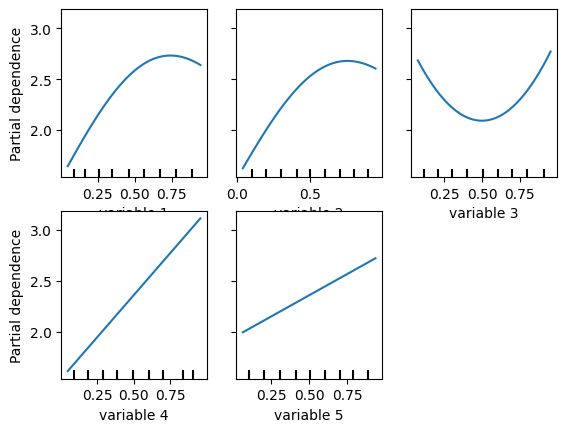
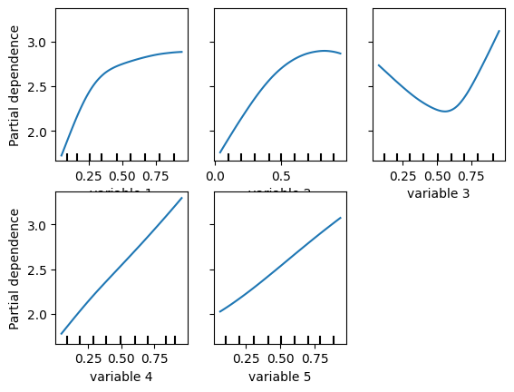
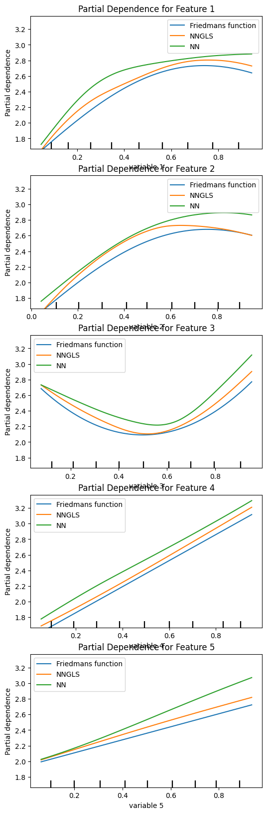

```python
import torch
import geospaNN
import numpy as np
import pandas as pd
import random
import matplotlib
import matplotlib.pyplot as plt

path = '../data/Output/'
```


```python
def f5(X): return (10 * np.sin(np.pi * X[:, 0] * X[:, 1]) + 20 * (X[:, 2] - 0.5) ** 2 + 10 * X[:, 3] + 5 * X[:, 4]) / 6
p = 5;
funXY = f5

n = 1000
nn = 20
b = 10

sigma = 1
phi = 1
Lambda = 0.01
theta = torch.tensor([sigma, phi / np.sqrt(2), Lambda])
```


```python
# Simulate data
torch.manual_seed(2024)
X, Y, coord, cov, corerr = geospaNN.Simulation(n, p, nn, funXY, theta, range=[0, b])

# Preprocess data
random.seed(2024)
X, Y, coord, _ = geospaNN.spatial_order(X, Y, coord, method='max-min')
data = geospaNN.make_graph(X, Y, coord, nn)

torch.manual_seed(2024)
np.random.seed(0)
data_train, data_val, data_test = geospaNN.split_data(X, Y, coord, neighbor_size=nn,
                                                      test_proportion=0.2)
```


```python
PDP_truth = geospaNN.visualize.plot_PDP(f5, X, names = ["PDP"], save_path = path, save = True)
```


    

    


```python
torch.manual_seed(2024)
mlp_nn = torch.nn.Sequential(
    torch.nn.Linear(p, 50),
    torch.nn.ReLU(),
    torch.nn.Linear(50, 20),
    torch.nn.ReLU(),
    torch.nn.Linear(20, 1)
)
trainer_nn = geospaNN.nn_train(mlp_nn, lr=0.01, min_delta=0.001)
training_log = trainer_nn.train(data_train, data_val, data_test, seed = 2)
theta0 = geospaNN.theta_update(mlp_nn(data_train.x).squeeze() - data_train.y, data_train.pos, neighbor_size=20)
```


```python
PDP_NN = geospaNN.visualize.plot_PDP(mlp_nn, X, names = ["PDP"], save_path = path, save = True)
```


    

    


```python
torch.manual_seed(2024)
mlp_nngls = torch.nn.Sequential(
    torch.nn.Linear(p, 50),
    torch.nn.ReLU(),
    torch.nn.Linear(50, 20),
    torch.nn.ReLU(),
    torch.nn.Linear(20, 1)
)
nngls = geospaNN.nngls(p=p, neighbor_size=nn, coord_dimensions=2, mlp=mlp_nngls, theta=torch.tensor(theta0))
trainer_nngls = geospaNN.nngls_train(nngls, lr=0.01, min_delta=0.001)
training_log = trainer_nngls.train(data_train, data_val, data_test,
                                   Update_init=20, Update_step=10, seed = 2)
```


```python
PDP_NNGLS = geospaNN.visualize.plot_PDP(mlp_nngls, X, names = ["PDP"], save_path = path, save = True)
```


    

    


```python
geospaNN.visualize.plot_PDP_list([funXY, mlp_nngls, mlp_nn], ['Friedmans function', 'NNGLS', 'NN'], X, split = True, save_path = path, save = True)
```
    


    

    

