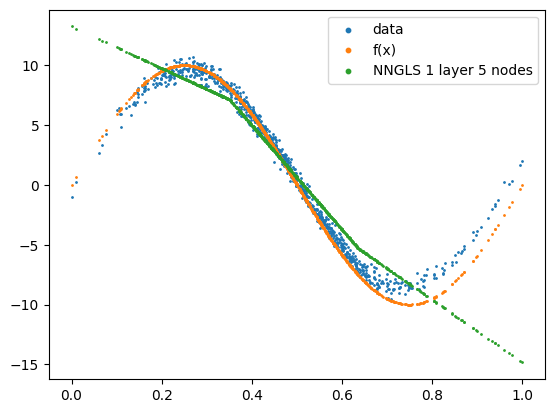
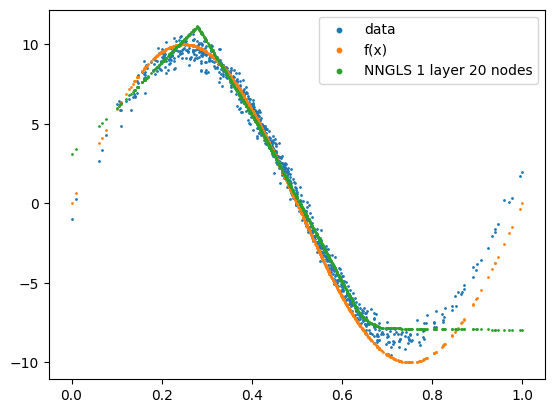
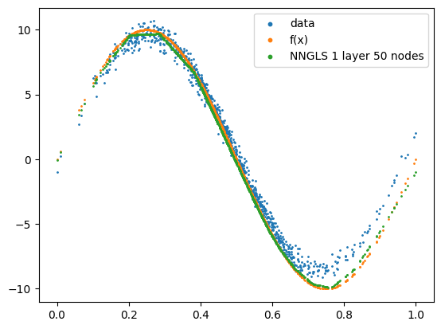
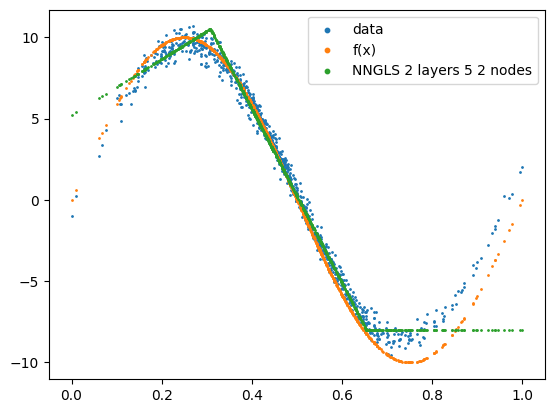
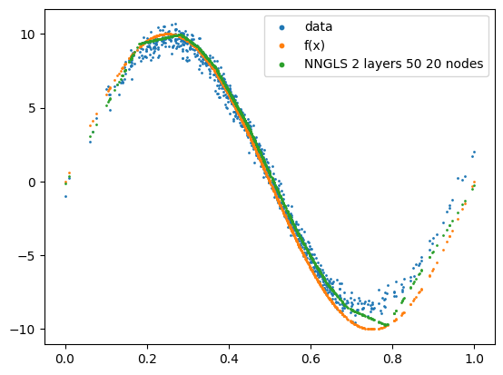
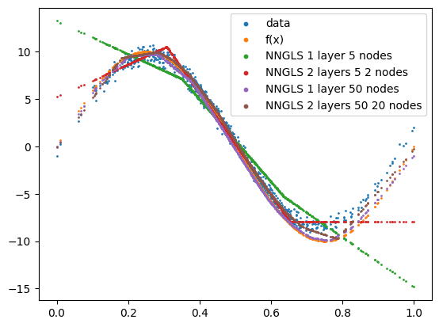

```python
import torch
import geospaNN
import numpy as np
import time
import pandas as pd
import seaborn as sns

import matplotlib
import matplotlib.pyplot as plt

path = '../data/Output/'
```

    R[write to console]: Loading required package: BRISC
    
    R[write to console]: Loading required package: RANN
    
    R[write to console]: Loading required package: parallel
    
    R[write to console]: Loading required package: rdist
    
    R[write to console]: Loading required package: matrixStats
    
    R[write to console]: Loading required package: pbapply
    
    R[write to console]: The ordering of inputs x (covariates) and y (response) in BRISC_estimation has been changed BRISC 1.0.0 onwards.
      Please check the new documentation with ?BRISC_estimation.
    


    R package: BRISC installed


    /Users/zhanwentao/opt/anaconda3/envs/NN/lib/python3.10/site-packages/pandas/core/arrays/masked.py:60: UserWarning: Pandas requires version '1.3.6' or newer of 'bottleneck' (version '1.3.5' currently installed).
      from pandas.core import (


```python
def f1(X): return 10 * np.sin(np.pi * 2 * X)


sigma = 1
phi = 0.1
Lambda = 0.01
theta = torch.tensor([sigma, phi / np.sqrt(2), Lambda])

p = 1;
funXY = f1

n = 1000
nn = 20
batch_size = 50

torch.manual_seed(2025)
_, _, _, _, X = geospaNN.Simulation(n, p, nn, funXY, torch.tensor([1, 5, 0.01]), range=[0, 1])
X = X.reshape(-1,1)
X = (X - X.min())/(X.max() - X.min())
torch.manual_seed(2025)
_, _, coord, cov, corerr = geospaNN.Simulation(n, p, nn, funXY, theta, range=[0, 1])
Y = funXY(X).reshape(-1) + corerr

torch.manual_seed(2024)
np.random.seed(0)
data_train, data_val, data_test = geospaNN.split_data(X, Y, coord, neighbor_size=nn,
                                                      test_proportion=0.2)
```


```python
torch.manual_seed(2025)
mlp_nn = torch.nn.Sequential(
    torch.nn.Linear(p, 5),
    torch.nn.ReLU(),
    torch.nn.Linear(5, 1)
)
trainer_nn = geospaNN.nn_train(mlp_nn, lr=0.01, min_delta=0.001)
training_log = trainer_nn.train(data_train, data_val, data_test)
theta0 = geospaNN.theta_update(mlp_nn(data_train.x).squeeze() - data_train.y, data_train.pos, neighbor_size=20)
```

    Epoch 00081: reducing learning rate of group 0 to 5.0000e-03.
    INFO: Early stopping
    End at epoch84
    ---------------------------------------- 
    	Ordering Coordinates 
    ----------------------------------------
    	Model description
    ----------------------------------------
    BRISC model fit with 600 observations.
    
    Number of covariates 1 (including intercept if specified).
    
    Using the exponential spatial correlation model.
    
    Using 15 nearest neighbors.
    
    
    
    Source not compiled with OpenMP support.
    ----------------------------------------
    	Building neighbor index
    ----------------------------------------
    	Performing optimization
    ----------------------------------------
    	Processing optimizers
    ----------------------------------------
    Theta estimated as
    [ 4.46885169 29.18811903  0.06182564]


```python
torch.manual_seed(2025)
mlp_linear = torch.nn.Sequential(
    torch.nn.Linear(p, 1),
)
model_linear = geospaNN.nngls(p=p, neighbor_size=nn, coord_dimensions=2, mlp=mlp_linear, theta = torch.tensor(theta0))
trainer_linear = geospaNN.nngls_train(model_linear, lr=0.01, min_delta=0.001)
training_log = trainer_linear.train(data_train, data_val, data_test,
                                        Update_init=10, Update_step=5)
```

    ---------------------------------------- 
    	Ordering Coordinates 
    ----------------------------------------
    	Model description
    ----------------------------------------
    BRISC model fit with 600 observations.
    
    Number of covariates 1 (including intercept if specified).
    
    Using the exponential spatial correlation model.
    
    Using 15 nearest neighbors.
    
    
    
    Source not compiled with OpenMP support.
    ----------------------------------------
    	Building neighbor index
    ----------------------------------------
    	Performing optimization
    ----------------------------------------
    	Processing optimizers
    ----------------------------------------
    Theta estimated as
    [3.66738529e+01 1.28390384e+01 1.00000000e-03]
    to
    [3.66738529e+01 1.28390384e+01 1.00000000e-03]
    ---------------------------------------- 
    	Ordering Coordinates 
    ----------------------------------------
    	Model description
    ----------------------------------------
    BRISC model fit with 600 observations.
    
    Number of covariates 1 (including intercept if specified).
    
    Using the exponential spatial correlation model.
    
    Using 15 nearest neighbors.
    
    
    
    Source not compiled with OpenMP support.
    ----------------------------------------
    	Building neighbor index
    ----------------------------------------
    	Performing optimization
    ----------------------------------------
    	Processing optimizers
    ----------------------------------------
    Theta estimated as
    [3.63286741e+01 1.28893571e+01 1.00000000e-03]
    to
    [3.63286741e+01 1.28893571e+01 1.00000000e-03]
    ---------------------------------------- 
    	Ordering Coordinates 
    ----------------------------------------
    	Model description
    ----------------------------------------
    BRISC model fit with 600 observations.
    
    Number of covariates 1 (including intercept if specified).
    
    Using the exponential spatial correlation model.
    
    Using 15 nearest neighbors.
    
    
    
    Source not compiled with OpenMP support.
    ----------------------------------------
    	Building neighbor index
    ----------------------------------------
    	Performing optimization
    ----------------------------------------
    	Processing optimizers
    ----------------------------------------
    Theta estimated as
    [3.60628717e+01 1.29286359e+01 1.00000000e-03]
    to
    [3.60628717e+01 1.29286359e+01 1.00000000e-03]
    ---------------------------------------- 
    	Ordering Coordinates 
    ----------------------------------------
    	Model description
    ----------------------------------------
    BRISC model fit with 600 observations.
    
    Number of covariates 1 (including intercept if specified).
    
    Using the exponential spatial correlation model.
    
    Using 15 nearest neighbors.
    
    
    
    Source not compiled with OpenMP support.
    ----------------------------------------
    	Building neighbor index
    ----------------------------------------
    	Performing optimization
    ----------------------------------------
    	Processing optimizers
    ----------------------------------------
    Theta estimated as
    [3.57685775e+01 1.29727299e+01 1.00000000e-03]
    to
    [3.57685775e+01 1.29727299e+01 1.00000000e-03]
    ---------------------------------------- 
    	Ordering Coordinates 
    ----------------------------------------
    	Model description
    ----------------------------------------
    BRISC model fit with 600 observations.
    
    Number of covariates 1 (including intercept if specified).
    
    Using the exponential spatial correlation model.
    
    Using 15 nearest neighbors.
    
    
    
    Source not compiled with OpenMP support.
    ----------------------------------------
    	Building neighbor index
    ----------------------------------------
    	Performing optimization
    ----------------------------------------
    	Processing optimizers
    ----------------------------------------
    Theta estimated as
    [3.54489480e+01 1.30200348e+01 1.00000000e-03]
    to
    [3.54489480e+01 1.30200348e+01 1.00000000e-03]
    ---------------------------------------- 
    	Ordering Coordinates 
    ----------------------------------------
    	Model description
    ----------------------------------------
    BRISC model fit with 600 observations.
    
    Number of covariates 1 (including intercept if specified).
    
    Using the exponential spatial correlation model.
    
    Using 15 nearest neighbors.
    
    
    
    Source not compiled with OpenMP support.
    ----------------------------------------
    	Building neighbor index
    ----------------------------------------
    	Performing optimization
    ----------------------------------------
    	Processing optimizers
    ----------------------------------------
    Theta estimated as
    [3.50969342e+01 1.30767560e+01 1.00000000e-03]
    to
    [3.50969342e+01 1.30767560e+01 1.00000000e-03]
    ---------------------------------------- 
    	Ordering Coordinates 
    ----------------------------------------
    	Model description
    ----------------------------------------
    BRISC model fit with 600 observations.
    
    Number of covariates 1 (including intercept if specified).
    
    Using the exponential spatial correlation model.
    
    Using 15 nearest neighbors.
    
    
    
    Source not compiled with OpenMP support.
    ----------------------------------------
    	Building neighbor index
    ----------------------------------------
    	Performing optimization
    ----------------------------------------
    	Processing optimizers
    ----------------------------------------
    Theta estimated as
    [3.47240827e+01 1.31364193e+01 1.00000000e-03]
    to
    [3.47240827e+01 1.31364193e+01 1.00000000e-03]
    ---------------------------------------- 
    	Ordering Coordinates 
    ----------------------------------------
    	Model description
    ----------------------------------------
    BRISC model fit with 600 observations.
    
    Number of covariates 1 (including intercept if specified).
    
    Using the exponential spatial correlation model.
    
    Using 15 nearest neighbors.
    
    
    
    Source not compiled with OpenMP support.
    ----------------------------------------
    	Building neighbor index
    ----------------------------------------
    	Performing optimization
    ----------------------------------------
    	Processing optimizers
    ----------------------------------------
    Theta estimated as
    [3.43314503e+01 1.32006688e+01 1.00000000e-03]
    to
    [3.43314503e+01 1.32006688e+01 1.00000000e-03]
    ---------------------------------------- 
    	Ordering Coordinates 
    ----------------------------------------
    	Model description
    ----------------------------------------
    BRISC model fit with 600 observations.
    
    Number of covariates 1 (including intercept if specified).
    
    Using the exponential spatial correlation model.
    
    Using 15 nearest neighbors.
    
    
    
    Source not compiled with OpenMP support.
    ----------------------------------------
    	Building neighbor index
    ----------------------------------------
    	Performing optimization
    ----------------------------------------
    	Processing optimizers
    ----------------------------------------
    Theta estimated as
    [3.39302035e+01 1.32670212e+01 1.00000000e-03]
    to
    [3.39302035e+01 1.32670212e+01 1.00000000e-03]
    ---------------------------------------- 
    	Ordering Coordinates 
    ----------------------------------------
    	Model description
    ----------------------------------------
    BRISC model fit with 600 observations.
    
    Number of covariates 1 (including intercept if specified).
    
    Using the exponential spatial correlation model.
    
    Using 15 nearest neighbors.
    
    
    
    Source not compiled with OpenMP support.
    ----------------------------------------
    	Building neighbor index
    ----------------------------------------
    	Performing optimization
    ----------------------------------------
    	Processing optimizers
    ----------------------------------------
    Theta estimated as
    [3.35099153e+01 1.33387394e+01 1.00000000e-03]
    to
    [3.35099153e+01 1.33387394e+01 1.00000000e-03]
    ---------------------------------------- 
    	Ordering Coordinates 
    ----------------------------------------
    	Model description
    ----------------------------------------
    BRISC model fit with 600 observations.
    
    Number of covariates 1 (including intercept if specified).
    
    Using the exponential spatial correlation model.
    
    Using 15 nearest neighbors.
    
    
    
    Source not compiled with OpenMP support.
    ----------------------------------------
    	Building neighbor index
    ----------------------------------------
    	Performing optimization
    ----------------------------------------
    	Processing optimizers
    ----------------------------------------
    Theta estimated as
    [3.30781740e+01 1.34142456e+01 1.00000000e-03]
    to
    [3.30781740e+01 1.34142456e+01 1.00000000e-03]
    ---------------------------------------- 
    	Ordering Coordinates 
    ----------------------------------------
    	Model description
    ----------------------------------------
    BRISC model fit with 600 observations.
    
    Number of covariates 1 (including intercept if specified).
    
    Using the exponential spatial correlation model.
    
    Using 15 nearest neighbors.
    
    
    
    Source not compiled with OpenMP support.
    ----------------------------------------
    	Building neighbor index
    ----------------------------------------
    	Performing optimization
    ----------------------------------------
    	Processing optimizers
    ----------------------------------------
    Theta estimated as
    [3.26293864e+01 1.34956162e+01 1.00000000e-03]
    to
    [3.26293864e+01 1.34956162e+01 1.00000000e-03]
    ---------------------------------------- 
    	Ordering Coordinates 
    ----------------------------------------
    	Model description
    ----------------------------------------
    BRISC model fit with 600 observations.
    
    Number of covariates 1 (including intercept if specified).
    
    Using the exponential spatial correlation model.
    
    Using 15 nearest neighbors.
    
    
    
    Source not compiled with OpenMP support.
    ----------------------------------------
    	Building neighbor index
    ----------------------------------------
    	Performing optimization
    ----------------------------------------
    	Processing optimizers
    ----------------------------------------
    Theta estimated as
    [3.21762499e+01 1.35786138e+01 1.00000000e-03]
    to
    [3.21762499e+01 1.35786138e+01 1.00000000e-03]
    ---------------------------------------- 
    	Ordering Coordinates 
    ----------------------------------------
    	Model description
    ----------------------------------------
    BRISC model fit with 600 observations.
    
    Number of covariates 1 (including intercept if specified).
    
    Using the exponential spatial correlation model.
    
    Using 15 nearest neighbors.
    
    
    
    Source not compiled with OpenMP support.
    ----------------------------------------
    	Building neighbor index
    ----------------------------------------
    	Performing optimization
    ----------------------------------------
    	Processing optimizers
    ----------------------------------------
    Theta estimated as
    [3.17085095e+01 1.36685682e+01 1.00000000e-03]
    to
    [3.17085095e+01 1.36685682e+01 1.00000000e-03]
    ---------------------------------------- 
    	Ordering Coordinates 
    ----------------------------------------
    	Model description
    ----------------------------------------
    BRISC model fit with 600 observations.
    
    Number of covariates 1 (including intercept if specified).
    
    Using the exponential spatial correlation model.
    
    Using 15 nearest neighbors.
    
    
    
    Source not compiled with OpenMP support.
    ----------------------------------------
    	Building neighbor index
    ----------------------------------------
    	Performing optimization
    ----------------------------------------
    	Processing optimizers
    ----------------------------------------
    Theta estimated as
    [3.12394565e+01 1.37617131e+01 1.00000000e-03]
    to
    [3.12394565e+01 1.37617131e+01 1.00000000e-03]
    ---------------------------------------- 
    	Ordering Coordinates 
    ----------------------------------------
    	Model description
    ----------------------------------------
    BRISC model fit with 600 observations.
    
    Number of covariates 1 (including intercept if specified).
    
    Using the exponential spatial correlation model.
    
    Using 15 nearest neighbors.
    
    
    
    Source not compiled with OpenMP support.
    ----------------------------------------
    	Building neighbor index
    ----------------------------------------
    	Performing optimization
    ----------------------------------------
    	Processing optimizers
    ----------------------------------------
    Theta estimated as
    [3.07609202e+01 1.38568921e+01 1.00000000e-03]
    to
    [3.07609202e+01 1.38568921e+01 1.00000000e-03]
    ---------------------------------------- 
    	Ordering Coordinates 
    ----------------------------------------
    	Model description
    ----------------------------------------
    BRISC model fit with 600 observations.
    
    Number of covariates 1 (including intercept if specified).
    
    Using the exponential spatial correlation model.
    
    Using 15 nearest neighbors.
    
    
    
    Source not compiled with OpenMP support.
    ----------------------------------------
    	Building neighbor index
    ----------------------------------------
    	Performing optimization
    ----------------------------------------
    	Processing optimizers
    ----------------------------------------
    Theta estimated as
    [3.02787671e+01 1.39564597e+01 1.00000000e-03]
    to
    [3.02787671e+01 1.39564597e+01 1.00000000e-03]
    ---------------------------------------- 
    	Ordering Coordinates 
    ----------------------------------------
    	Model description
    ----------------------------------------
    BRISC model fit with 600 observations.
    
    Number of covariates 1 (including intercept if specified).
    
    Using the exponential spatial correlation model.
    
    Using 15 nearest neighbors.
    
    
    
    Source not compiled with OpenMP support.
    ----------------------------------------
    	Building neighbor index
    ----------------------------------------
    	Performing optimization
    ----------------------------------------
    	Processing optimizers
    ----------------------------------------
    Theta estimated as
    [2.97806301e+01 1.40683939e+01 1.00000000e-03]
    to
    [2.97806301e+01 1.40683939e+01 1.00000000e-03]


```python
torch.manual_seed(2025)
mlp_l1_n5 = torch.nn.Sequential(
    torch.nn.Linear(p, 5),
    torch.nn.ReLU(),
    torch.nn.Linear(5, 1)
)
nngls_l1_n5 = geospaNN.nngls(p=p, neighbor_size=nn, coord_dimensions=2, mlp=mlp_l1_n5, theta=torch.tensor(theta0))
trainer_l1_n5 = geospaNN.nngls_train(nngls_l1_n5, lr=0.1, min_delta=0.001)
training_log = trainer_l1_n5.train(data_train, data_val, data_test,
                                   Update_init=20, Update_step=5, seed = 2024)
```

    Epoch 00011: reducing learning rate of group 0 to 5.0000e-02.
    INFO: Early stopping
    End at epoch14


```python
torch.manual_seed(2025)
mlp_l1_n20 = torch.nn.Sequential(
    torch.nn.Linear(p, 20),
    torch.nn.ReLU(),
    torch.nn.Linear(20, 1)
)
nngls_l1_n20 = geospaNN.nngls(p=p, neighbor_size=nn, coord_dimensions=2, mlp=mlp_l1_n20, 
                              theta=torch.tensor(theta0))
trainer_l1_n20 = geospaNN.nngls_train(nngls_l1_n20, lr=0.01, min_delta=0.001)
training_log = trainer_l1_n20.train(data_train, data_val, data_test,
                                    Update_init=20, Update_step=5, seed = 2024)
```

    ---------------------------------------- 
    	Ordering Coordinates 
    ----------------------------------------
    	Model description
    ----------------------------------------
    BRISC model fit with 600 observations.
    
    Number of covariates 1 (including intercept if specified).
    
    Using the exponential spatial correlation model.
    
    Using 15 nearest neighbors.
    
    
    
    Source not compiled with OpenMP support.
    ----------------------------------------
    	Building neighbor index
    ----------------------------------------
    	Performing optimization
    ----------------------------------------
    	Processing optimizers
    ----------------------------------------
    Theta estimated as
    [5.88382895e+00 3.57918116e+01 2.09636078e-03]
    to
    [5.88382895e+00 3.57918116e+01 2.09636078e-03]
    ---------------------------------------- 
    	Ordering Coordinates 
    ----------------------------------------
    	Model description
    ----------------------------------------
    BRISC model fit with 600 observations.
    
    Number of covariates 1 (including intercept if specified).
    
    Using the exponential spatial correlation model.
    
    Using 15 nearest neighbors.
    
    
    
    Source not compiled with OpenMP support.
    ----------------------------------------
    	Building neighbor index
    ----------------------------------------
    	Performing optimization
    ----------------------------------------
    	Processing optimizers
    ----------------------------------------
    Theta estimated as
    [5.60625954e+00 3.49603856e+01 1.06904541e-02]
    to
    [5.60625954e+00 3.49603856e+01 1.06904541e-02]
    ---------------------------------------- 
    	Ordering Coordinates 
    ----------------------------------------
    	Model description
    ----------------------------------------
    BRISC model fit with 600 observations.
    
    Number of covariates 1 (including intercept if specified).
    
    Using the exponential spatial correlation model.
    
    Using 15 nearest neighbors.
    
    
    
    Source not compiled with OpenMP support.
    ----------------------------------------
    	Building neighbor index
    ----------------------------------------
    	Performing optimization
    ----------------------------------------
    	Processing optimizers
    ----------------------------------------
    Theta estimated as
    [5.25672968e+00 3.39622830e+01 1.94679461e-02]
    to
    [5.25672968e+00 3.39622830e+01 1.94679461e-02]
    ---------------------------------------- 
    	Ordering Coordinates 
    ----------------------------------------
    	Model description
    ----------------------------------------
    BRISC model fit with 600 observations.
    
    Number of covariates 1 (including intercept if specified).
    
    Using the exponential spatial correlation model.
    
    Using 15 nearest neighbors.
    
    
    
    Source not compiled with OpenMP support.
    ----------------------------------------
    	Building neighbor index
    ----------------------------------------
    	Performing optimization
    ----------------------------------------
    	Processing optimizers
    ----------------------------------------
    Theta estimated as
    [4.72813032e+00 3.28836467e+01 3.21624115e-02]
    to
    [4.72813032e+00 3.28836467e+01 3.21624115e-02]
    ---------------------------------------- 
    	Ordering Coordinates 
    ----------------------------------------
    	Model description
    ----------------------------------------
    BRISC model fit with 600 observations.
    
    Number of covariates 1 (including intercept if specified).
    
    Using the exponential spatial correlation model.
    
    Using 15 nearest neighbors.
    
    
    
    Source not compiled with OpenMP support.
    ----------------------------------------
    	Building neighbor index
    ----------------------------------------
    	Performing optimization
    ----------------------------------------
    	Processing optimizers
    ----------------------------------------
    Theta estimated as
    [ 4.13045288 30.68651563  0.05079838]
    to
    [ 4.13045288 30.68651563  0.05079838]
    ---------------------------------------- 
    	Ordering Coordinates 
    ----------------------------------------
    	Model description
    ----------------------------------------
    BRISC model fit with 600 observations.
    
    Number of covariates 1 (including intercept if specified).
    
    Using the exponential spatial correlation model.
    
    Using 15 nearest neighbors.
    
    
    
    Source not compiled with OpenMP support.
    ----------------------------------------
    	Building neighbor index
    ----------------------------------------
    	Performing optimization
    ----------------------------------------
    	Processing optimizers
    ----------------------------------------
    Theta estimated as
    [ 3.50873715 27.93250465  0.07458953]
    to
    [ 3.50873715 27.93250465  0.07458953]
    ---------------------------------------- 
    	Ordering Coordinates 
    ----------------------------------------
    	Model description
    ----------------------------------------
    BRISC model fit with 600 observations.
    
    Number of covariates 1 (including intercept if specified).
    
    Using the exponential spatial correlation model.
    
    Using 15 nearest neighbors.
    
    
    
    Source not compiled with OpenMP support.
    ----------------------------------------
    	Building neighbor index
    ----------------------------------------
    	Performing optimization
    ----------------------------------------
    	Processing optimizers
    ----------------------------------------
    Theta estimated as
    [ 2.97685087 24.64432414  0.09430919]
    to
    [ 2.97685087 24.64432414  0.09430919]
    ---------------------------------------- 
    	Ordering Coordinates 
    ----------------------------------------
    	Model description
    ----------------------------------------
    BRISC model fit with 600 observations.
    
    Number of covariates 1 (including intercept if specified).
    
    Using the exponential spatial correlation model.
    
    Using 15 nearest neighbors.
    
    
    
    Source not compiled with OpenMP support.
    ----------------------------------------
    	Building neighbor index
    ----------------------------------------
    	Performing optimization
    ----------------------------------------
    	Processing optimizers
    ----------------------------------------
    Theta estimated as
    [ 2.51613956 22.00177159  0.11313817]
    to
    [ 2.51613956 22.00177159  0.11313817]
    ---------------------------------------- 
    	Ordering Coordinates 
    ----------------------------------------
    	Model description
    ----------------------------------------
    BRISC model fit with 600 observations.
    
    Number of covariates 1 (including intercept if specified).
    
    Using the exponential spatial correlation model.
    
    Using 15 nearest neighbors.
    
    
    
    Source not compiled with OpenMP support.
    ----------------------------------------
    	Building neighbor index
    ----------------------------------------
    	Performing optimization
    ----------------------------------------
    	Processing optimizers
    ----------------------------------------
    Theta estimated as
    [ 2.18686658 19.75902602  0.12430619]
    to
    [ 2.18686658 19.75902602  0.12430619]
    ---------------------------------------- 
    	Ordering Coordinates 
    ----------------------------------------
    	Model description
    ----------------------------------------
    BRISC model fit with 600 observations.
    
    Number of covariates 1 (including intercept if specified).
    
    Using the exponential spatial correlation model.
    
    Using 15 nearest neighbors.
    
    
    
    Source not compiled with OpenMP support.
    ----------------------------------------
    	Building neighbor index
    ----------------------------------------
    	Performing optimization
    ----------------------------------------
    	Processing optimizers
    ----------------------------------------
    Theta estimated as
    [ 1.96155695 17.95483939  0.1302087 ]
    to
    [ 1.96155695 17.95483939  0.1302087 ]
    ---------------------------------------- 
    	Ordering Coordinates 
    ----------------------------------------
    	Model description
    ----------------------------------------
    BRISC model fit with 600 observations.
    
    Number of covariates 1 (including intercept if specified).
    
    Using the exponential spatial correlation model.
    
    Using 15 nearest neighbors.
    
    
    
    Source not compiled with OpenMP support.
    ----------------------------------------
    	Building neighbor index
    ----------------------------------------
    	Performing optimization
    ----------------------------------------
    	Processing optimizers
    ----------------------------------------
    Theta estimated as
    [ 1.81550672 16.52153382  0.1301488 ]
    to
    [ 1.81550672 16.52153382  0.1301488 ]
    ---------------------------------------- 
    	Ordering Coordinates 
    ----------------------------------------
    	Model description
    ----------------------------------------
    BRISC model fit with 600 observations.
    
    Number of covariates 1 (including intercept if specified).
    
    Using the exponential spatial correlation model.
    
    Using 15 nearest neighbors.
    
    
    
    Source not compiled with OpenMP support.
    ----------------------------------------
    	Building neighbor index
    ----------------------------------------
    	Performing optimization
    ----------------------------------------
    	Processing optimizers
    ----------------------------------------
    Theta estimated as
    [ 1.63067242 16.26238608  0.14030504]
    to
    [ 1.63067242 16.26238608  0.14030504]
    ---------------------------------------- 
    	Ordering Coordinates 
    ----------------------------------------
    	Model description
    ----------------------------------------
    BRISC model fit with 600 observations.
    
    Number of covariates 1 (including intercept if specified).
    
    Using the exponential spatial correlation model.
    
    Using 15 nearest neighbors.
    
    
    
    Source not compiled with OpenMP support.
    ----------------------------------------
    	Building neighbor index
    ----------------------------------------
    	Performing optimization
    ----------------------------------------
    	Processing optimizers
    ----------------------------------------
    Theta estimated as
    [ 1.47256223 16.18518096  0.14687251]
    to
    [ 1.47256223 16.18518096  0.14687251]
    ---------------------------------------- 
    	Ordering Coordinates 
    ----------------------------------------
    	Model description
    ----------------------------------------
    BRISC model fit with 600 observations.
    
    Number of covariates 1 (including intercept if specified).
    
    Using the exponential spatial correlation model.
    
    Using 15 nearest neighbors.
    
    
    
    Source not compiled with OpenMP support.
    ----------------------------------------
    	Building neighbor index
    ----------------------------------------
    	Performing optimization
    ----------------------------------------
    	Processing optimizers
    ----------------------------------------
    Theta estimated as
    [ 1.44804289 14.41262253  0.13727856]
    to
    [ 1.44804289 14.41262253  0.13727856]
    ---------------------------------------- 
    	Ordering Coordinates 
    ----------------------------------------
    	Model description
    ----------------------------------------
    BRISC model fit with 600 observations.
    
    Number of covariates 1 (including intercept if specified).
    
    Using the exponential spatial correlation model.
    
    Using 15 nearest neighbors.
    
    
    
    Source not compiled with OpenMP support.
    ----------------------------------------
    	Building neighbor index
    ----------------------------------------
    	Performing optimization
    ----------------------------------------
    	Processing optimizers
    ----------------------------------------
    Theta estimated as
    [ 1.18971969 15.44141635  0.1690306 ]
    to
    [ 1.18971969 15.44141635  0.1690306 ]
    ---------------------------------------- 
    	Ordering Coordinates 
    ----------------------------------------
    	Model description
    ----------------------------------------
    BRISC model fit with 600 observations.
    
    Number of covariates 1 (including intercept if specified).
    
    Using the exponential spatial correlation model.
    
    Using 15 nearest neighbors.
    
    
    
    Source not compiled with OpenMP support.
    ----------------------------------------
    	Building neighbor index
    ----------------------------------------
    	Performing optimization
    ----------------------------------------
    	Processing optimizers
    ----------------------------------------
    Theta estimated as
    [ 1.05784755 15.00361235  0.1829317 ]
    to
    [ 1.05784755 15.00361235  0.1829317 ]


```python
torch.manual_seed(2025)
mlp_l1_n50 = torch.nn.Sequential(
    torch.nn.Linear(p, 50),
    torch.nn.ReLU(),
    torch.nn.Linear(50, 1)
)
nngls_l1_n50 = geospaNN.nngls(p=p, neighbor_size=nn, coord_dimensions=2, mlp=mlp_l1_n50, 
                              theta=torch.tensor(theta0))
trainer_l1_n50 = geospaNN.nngls_train(nngls_l1_n50, lr=0.1, min_delta=0.001)
training_log = trainer_l1_n50.train(data_train, data_val, data_test,
                                    Update_init=10, Update_step=5, seed = 2024)
```

    ---------------------------------------- 
    	Ordering Coordinates 
    ----------------------------------------
    	Model description
    ----------------------------------------
    BRISC model fit with 600 observations.
    
    Number of covariates 1 (including intercept if specified).
    
    Using the exponential spatial correlation model.
    
    Using 15 nearest neighbors.
    
    
    
    Source not compiled with OpenMP support.
    ----------------------------------------
    	Building neighbor index
    ----------------------------------------
    	Performing optimization
    ----------------------------------------
    	Processing optimizers
    ----------------------------------------
    Theta estimated as
    [ 2.74893171 16.64279543  0.09969586]
    to
    [ 2.74893171 16.64279543  0.09969586]
    ---------------------------------------- 
    	Ordering Coordinates 
    ----------------------------------------
    	Model description
    ----------------------------------------
    BRISC model fit with 600 observations.
    
    Number of covariates 1 (including intercept if specified).
    
    Using the exponential spatial correlation model.
    
    Using 15 nearest neighbors.
    
    
    
    Source not compiled with OpenMP support.
    ----------------------------------------
    	Building neighbor index
    ----------------------------------------
    	Performing optimization
    ----------------------------------------
    	Processing optimizers
    ----------------------------------------
    Theta estimated as
    [ 0.76625676 15.46842855  0.14276546]
    to
    [ 0.76625676 15.46842855  0.14276546]
    ---------------------------------------- 
    	Ordering Coordinates 
    ----------------------------------------
    	Model description
    ----------------------------------------
    BRISC model fit with 600 observations.
    
    Number of covariates 1 (including intercept if specified).
    
    Using the exponential spatial correlation model.
    
    Using 15 nearest neighbors.
    
    
    
    Source not compiled with OpenMP support.
    ----------------------------------------
    	Building neighbor index
    ----------------------------------------
    	Performing optimization
    ----------------------------------------
    	Processing optimizers
    ----------------------------------------
    Theta estimated as
    [ 0.31323428 15.57372957  0.23777087]
    to
    [ 0.31323428 15.57372957  0.23777087]
    ---------------------------------------- 
    	Ordering Coordinates 
    ----------------------------------------
    	Model description
    ----------------------------------------
    BRISC model fit with 600 observations.
    
    Number of covariates 1 (including intercept if specified).
    
    Using the exponential spatial correlation model.
    
    Using 15 nearest neighbors.
    
    
    
    Source not compiled with OpenMP support.
    ----------------------------------------
    	Building neighbor index
    ----------------------------------------
    	Performing optimization
    ----------------------------------------
    	Processing optimizers
    ----------------------------------------
    Theta estimated as
    [0.33252968 8.80009626 0.11421392]
    to
    [0.33252968 8.80009626 0.11421392]
    Epoch 00030: reducing learning rate of group 0 to 5.0000e-02.
    ---------------------------------------- 
    	Ordering Coordinates 
    ----------------------------------------
    	Model description
    ----------------------------------------
    BRISC model fit with 600 observations.
    
    Number of covariates 1 (including intercept if specified).
    
    Using the exponential spatial correlation model.
    
    Using 15 nearest neighbors.
    
    
    
    Source not compiled with OpenMP support.
    ----------------------------------------
    	Building neighbor index
    ----------------------------------------
    	Performing optimization
    ----------------------------------------
    	Processing optimizers
    ----------------------------------------
    Theta estimated as
    [0.19349976 8.13731974 0.15386363]
    to
    [0.19349976 8.13731974 0.15386363]
    INFO: Early stopping
    End at epoch33


```python
torch.manual_seed(2025)
mlp_l2_n5_2 = torch.nn.Sequential(
    torch.nn.Linear(p, 5),
    torch.nn.ReLU(),
    torch.nn.Linear(5, 2),
    torch.nn.ReLU(),
    torch.nn.Linear(2, 1)
)
nngls_l2_n5_2 = geospaNN.nngls(p=p, neighbor_size=nn, coord_dimensions=2, mlp=mlp_l2_n5_2, theta=torch.tensor(theta0))
trainer_l2_n5_2 = geospaNN.nngls_train(nngls_l2_n5_2, lr=0.1, min_delta=0.001)
training_log = trainer_l2_n5_2.train(data_train, data_val, data_test,
                                     Update_init=10, Update_step=5, seed = 2024)
```

    ---------------------------------------- 
    	Ordering Coordinates 
    ----------------------------------------
    	Model description
    ----------------------------------------
    BRISC model fit with 600 observations.
    
    Number of covariates 1 (including intercept if specified).
    
    Using the exponential spatial correlation model.
    
    Using 15 nearest neighbors.
    
    
    
    Source not compiled with OpenMP support.
    ----------------------------------------
    	Building neighbor index
    ----------------------------------------
    	Performing optimization
    ----------------------------------------
    	Processing optimizers
    ----------------------------------------
    Theta estimated as
    [ 1.58066505 32.42580587  0.19364144]
    to
    [ 1.58066505 32.42580587  0.19364144]
    ---------------------------------------- 
    	Ordering Coordinates 
    ----------------------------------------
    	Model description
    ----------------------------------------
    BRISC model fit with 600 observations.
    
    Number of covariates 1 (including intercept if specified).
    
    Using the exponential spatial correlation model.
    
    Using 15 nearest neighbors.
    
    
    
    Source not compiled with OpenMP support.
    ----------------------------------------
    	Building neighbor index
    ----------------------------------------
    	Performing optimization
    ----------------------------------------
    	Processing optimizers
    ----------------------------------------
    Theta estimated as
    [ 1.26690691 14.6288026   0.27911908]
    to
    [ 1.26690691 14.6288026   0.27911908]
    ---------------------------------------- 
    	Ordering Coordinates 
    ----------------------------------------
    	Model description
    ----------------------------------------
    BRISC model fit with 600 observations.
    
    Number of covariates 1 (including intercept if specified).
    
    Using the exponential spatial correlation model.
    
    Using 15 nearest neighbors.
    
    
    
    Source not compiled with OpenMP support.
    ----------------------------------------
    	Building neighbor index
    ----------------------------------------
    	Performing optimization
    ----------------------------------------
    	Processing optimizers
    ----------------------------------------
    Theta estimated as
    [ 1.14261477 14.65000836  0.23289709]
    to
    [ 1.14261477 14.65000836  0.23289709]
    Epoch 00022: reducing learning rate of group 0 to 5.0000e-02.
    ---------------------------------------- 
    	Ordering Coordinates 
    ----------------------------------------
    	Model description
    ----------------------------------------
    BRISC model fit with 600 observations.
    
    Number of covariates 1 (including intercept if specified).
    
    Using the exponential spatial correlation model.
    
    Using 15 nearest neighbors.
    
    
    
    Source not compiled with OpenMP support.
    ----------------------------------------
    	Building neighbor index
    ----------------------------------------
    	Performing optimization
    ----------------------------------------
    	Processing optimizers
    ----------------------------------------
    Theta estimated as
    [ 1.0191259  14.21936374  0.27032242]
    to
    [ 1.0191259  14.21936374  0.27032242]
    ---------------------------------------- 
    	Ordering Coordinates 
    ----------------------------------------
    	Model description
    ----------------------------------------
    BRISC model fit with 600 observations.
    
    Number of covariates 1 (including intercept if specified).
    
    Using the exponential spatial correlation model.
    
    Using 15 nearest neighbors.
    
    
    
    Source not compiled with OpenMP support.
    ----------------------------------------
    	Building neighbor index
    ----------------------------------------
    	Performing optimization
    ----------------------------------------
    	Processing optimizers
    ----------------------------------------
    Theta estimated as
    [ 0.93002899 17.756489    0.31867698]
    to
    [ 0.93002899 17.756489    0.31867698]
    Epoch 00032: reducing learning rate of group 0 to 2.5000e-02.
    ---------------------------------------- 
    	Ordering Coordinates 
    ----------------------------------------
    	Model description
    ----------------------------------------
    BRISC model fit with 600 observations.
    
    Number of covariates 1 (including intercept if specified).
    
    Using the exponential spatial correlation model.
    
    Using 15 nearest neighbors.
    
    
    
    Source not compiled with OpenMP support.
    ----------------------------------------
    	Building neighbor index
    ----------------------------------------
    	Performing optimization
    ----------------------------------------
    	Processing optimizers
    ----------------------------------------
    Theta estimated as
    [ 0.90649247 15.46520488  0.28231436]
    to
    [ 0.90649247 15.46520488  0.28231436]
    ---------------------------------------- 
    	Ordering Coordinates 
    ----------------------------------------
    	Model description
    ----------------------------------------
    BRISC model fit with 600 observations.
    
    Number of covariates 1 (including intercept if specified).
    
    Using the exponential spatial correlation model.
    
    Using 15 nearest neighbors.
    
    
    
    Source not compiled with OpenMP support.
    ----------------------------------------
    	Building neighbor index
    ----------------------------------------
    	Performing optimization
    ----------------------------------------
    	Processing optimizers
    ----------------------------------------
    Theta estimated as
    [ 0.94484514 15.03066012  0.25497378]
    to
    [ 0.94484514 15.03066012  0.25497378]
    Epoch 00041: reducing learning rate of group 0 to 1.2500e-02.
    INFO: Early stopping
    End at epoch44


```python
torch.manual_seed(2025)
mlp_l2_n50_20 = torch.nn.Sequential(
    torch.nn.Linear(p, 50),
    torch.nn.ReLU(),
    torch.nn.Linear(50, 20),
    torch.nn.ReLU(),
    torch.nn.Linear(20, 1)
)
nngls_l2_n50_20 = geospaNN.nngls(p=p, neighbor_size=nn, coord_dimensions=2, mlp=mlp_l2_n50_20, theta=torch.tensor(theta0))
trainer_l2_n50_20 = geospaNN.nngls_train(nngls_l2_n50_20, lr=0.1, min_delta=0.001)
training_log = trainer_l2_n50_20.train(data_train, data_val, data_test,
                                       Update_init=10, Update_step=5, seed = 2024)
```

    ---------------------------------------- 
    	Ordering Coordinates 
    ----------------------------------------
    	Model description
    ----------------------------------------
    BRISC model fit with 600 observations.
    
    Number of covariates 1 (including intercept if specified).
    
    Using the exponential spatial correlation model.
    
    Using 15 nearest neighbors.
    
    
    
    Source not compiled with OpenMP support.
    ----------------------------------------
    	Building neighbor index
    ----------------------------------------
    	Performing optimization
    ----------------------------------------
    	Processing optimizers
    ----------------------------------------
    Theta estimated as
    [ 0.84932386 21.7438003   0.12269381]
    to
    [ 0.84932386 21.7438003   0.12269381]
    ---------------------------------------- 
    	Ordering Coordinates 
    ----------------------------------------
    	Model description
    ----------------------------------------
    BRISC model fit with 600 observations.
    
    Number of covariates 1 (including intercept if specified).
    
    Using the exponential spatial correlation model.
    
    Using 15 nearest neighbors.
    
    
    
    Source not compiled with OpenMP support.
    ----------------------------------------
    	Building neighbor index
    ----------------------------------------
    	Performing optimization
    ----------------------------------------
    	Processing optimizers
    ----------------------------------------
    Theta estimated as
    [ 0.23895011 16.07087659  0.20497415]
    to
    [ 0.23895011 16.07087659  0.20497415]
    ---------------------------------------- 
    	Ordering Coordinates 
    ----------------------------------------
    	Model description
    ----------------------------------------
    BRISC model fit with 600 observations.
    
    Number of covariates 1 (including intercept if specified).
    
    Using the exponential spatial correlation model.
    
    Using 15 nearest neighbors.
    
    
    
    Source not compiled with OpenMP support.
    ----------------------------------------
    	Building neighbor index
    ----------------------------------------
    	Performing optimization
    ----------------------------------------
    	Processing optimizers
    ----------------------------------------
    Theta estimated as
    [ 0.63853268 14.30718911  0.10260391]
    to
    [ 0.63853268 14.30718911  0.10260391]
    Epoch 00021: reducing learning rate of group 0 to 5.0000e-02.
    ---------------------------------------- 
    	Ordering Coordinates 
    ----------------------------------------
    	Model description
    ----------------------------------------
    BRISC model fit with 600 observations.
    
    Number of covariates 1 (including intercept if specified).
    
    Using the exponential spatial correlation model.
    
    Using 15 nearest neighbors.
    
    
    
    Source not compiled with OpenMP support.
    ----------------------------------------
    	Building neighbor index
    ----------------------------------------
    	Performing optimization
    ----------------------------------------
    	Processing optimizers
    ----------------------------------------
    Theta estimated as
    [0.36785569 3.00446034 0.06846785]
    to
    [0.36785569 3.00446034 0.06846785]
    ---------------------------------------- 
    	Ordering Coordinates 
    ----------------------------------------
    	Model description
    ----------------------------------------
    BRISC model fit with 600 observations.
    
    Number of covariates 1 (including intercept if specified).
    
    Using the exponential spatial correlation model.
    
    Using 15 nearest neighbors.
    
    
    
    Source not compiled with OpenMP support.
    ----------------------------------------
    	Building neighbor index
    ----------------------------------------
    	Performing optimization
    ----------------------------------------
    	Processing optimizers
    ----------------------------------------
    Theta estimated as
    [0.20279745 9.58747506 0.17595671]
    to
    [0.20279745 9.58747506 0.17595671]
    ---------------------------------------- 
    	Ordering Coordinates 
    ----------------------------------------
    	Model description
    ----------------------------------------
    BRISC model fit with 600 observations.
    
    Number of covariates 1 (including intercept if specified).
    
    Using the exponential spatial correlation model.
    
    Using 15 nearest neighbors.
    
    
    
    Source not compiled with OpenMP support.
    ----------------------------------------
    	Building neighbor index
    ----------------------------------------
    	Performing optimization
    ----------------------------------------
    	Processing optimizers
    ----------------------------------------
    Theta estimated as
    [0.38799714 2.05289669 0.05888761]
    to
    [0.38799714 2.05289669 0.05888761]
    Epoch 00036: reducing learning rate of group 0 to 2.5000e-02.
    INFO: Early stopping
    End at epoch39


```python
plt.clf()
plt.scatter(X.detach().numpy(), Y.detach().numpy(), s=1, label='data')
plt.scatter(X.detach().numpy(), funXY(X.detach().numpy()), s=1, label='f(x)')
plt.scatter(X.detach().numpy(), mlp_l1_n5(X).detach().numpy(), s=1, label='NNGLS 1 layer 5 nodes')
#plt.scatter(X.detach().numpy(), mlp_l1_n20(X).detach().numpy(), s=1, label='NNGLS 1 layer 20 nodes')
#plt.scatter(X.detach().numpy(), mlp_l1_n50(X).detach().numpy(), s=1, label='NNGLS 1 layer 50 nodes')
lgnd = plt.legend()
for handle in lgnd.legend_handles:
    handle.set_sizes([10.0])
plt.savefig(path + 'l1n5.png')
```


    

    


```python
plt.clf()
plt.scatter(X.detach().numpy(), Y.detach().numpy(), s=1, label='data')
plt.scatter(X.detach().numpy(), funXY(X.detach().numpy()), s=1, label='f(x)')
#plt.scatter(X.detach().numpy(), mlp_l1_n5(X).detach().numpy(), s=1, label='NNGLS 1 layer 5 nodes')
plt.scatter(X.detach().numpy(), mlp_l1_n20(X).detach().numpy(), s=1, label='NNGLS 1 layer 20 nodes')
#plt.scatter(X.detach().numpy(), mlp_l1_n50(X).detach().numpy(), s=1, label='NNGLS 1 layer 50 nodes')
lgnd = plt.legend()
for handle in lgnd.legend_handles:
    handle.set_sizes([10.0])
plt.savefig(path + 'l1n20.png')
```


    

    


```python
plt.clf()
plt.scatter(X.detach().numpy(), Y.detach().numpy(), s=1, label='data')
plt.scatter(X.detach().numpy(), funXY(X.detach().numpy()), s=1, label='f(x)')
#plt.scatter(X.detach().numpy(), mlp_l1_n5(X).detach().numpy(), s=1, label='NNGLS 1 layer 5 nodes')
#plt.scatter(X.detach().numpy(), mlp_l1_n20(X).detach().numpy(), s=1, label='NNGLS 1 layer 20 nodes')
plt.scatter(X.detach().numpy(), mlp_l1_n50(X).detach().numpy(), s=1, label='NNGLS 1 layer 50 nodes')
lgnd = plt.legend()
for handle in lgnd.legend_handles:
    handle.set_sizes([10.0])
plt.savefig(path + 'l1n50.png')
```


    

    


```python
plt.clf()
plt.scatter(X.detach().numpy(), Y.detach().numpy(), s=1, label='data')
plt.scatter(X.detach().numpy(), funXY(X.detach().numpy()), s=1, label='f(x)')
plt.scatter(X.detach().numpy(), mlp_l2_n5_2(X).detach().numpy(), s=1, label='NNGLS 2 layers 5 2 nodes')
#plt.scatter(X.detach().numpy(), mlp_l2_n50_20(X).detach().numpy(), s=1, label='NNGLS 2 layers 50 20 nodes')
lgnd = plt.legend()
for handle in lgnd.legend_handles:
    handle.set_sizes([10.0])
plt.savefig(path + 'l2n5_2.png')
```


    

    


```python
plt.clf()
plt.scatter(X.detach().numpy(), Y.detach().numpy(), s=1, label='data')
plt.scatter(X.detach().numpy(), funXY(X.detach().numpy()), s=1, label='f(x)')
#plt.scatter(X.detach().numpy(), mlp_l2_n5_2(X).detach().numpy(), s=1, label='NNGLS 2 layers 5 2 nodes')
plt.scatter(X.detach().numpy(), mlp_l2_n50_20(X).detach().numpy(), s=1, label='NNGLS 2 layers 50 20 nodes')
lgnd = plt.legend()
for handle in lgnd.legend_handles:
    handle.set_sizes([10.0])
plt.savefig(path + 'l2n50_20.png')
```


    

    


```python
plt.clf()
plt.scatter(X.detach().numpy(), Y.detach().numpy(), s=1, label='data')
plt.scatter(X.detach().numpy(), funXY(X.detach().numpy()), s=1, label='f(x)')
plt.scatter(X.detach().numpy(), mlp_l1_n5(X).detach().numpy(), s=1, label='NNGLS 1 layer 5 nodes')
plt.scatter(X.detach().numpy(), mlp_l2_n5_2(X).detach().numpy(), s=1, label='NNGLS 2 layers 5 2 nodes')
plt.scatter(X.detach().numpy(), mlp_l1_n50(X).detach().numpy(), s=1, label='NNGLS 1 layer 50 nodes')
plt.scatter(X.detach().numpy(), mlp_l2_n50_20(X).detach().numpy(), s=1, label='NNGLS 2 layers 50 20 nodes')
lgnd = plt.legend()
for handle in lgnd.legend_handles:
    handle.set_sizes([10.0])
plt.show()
```


    

    


```python

```


```python

```
