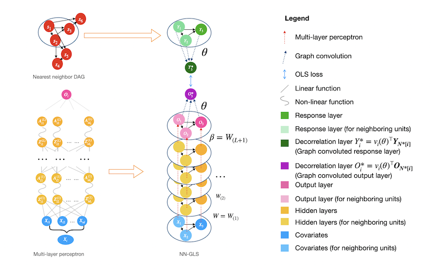

The Python package **geospaNN** stands for 'geospatial Neural Networks', where we implement NN-GLS, 
neural networks tailored for analysis of geospatial data that explicitly accounts for spatial dependence (Zhan et.al, 2024). 
Geospatial data naturally exhibits spatial correlation or dependence and traditional geostatistical analysis often relies on 
model-based approaches to handle the spatial dependency, treating the spatial outcome y(s) as a linear regression on covariates x(s) and 
modeling dependency through the spatially correlated errors. 
For example, using Gaussian processes (GP) to model dependent errors, 
simple techniques like kriging can provide powerful prediction performance by properly aggregating the neighboring information. 
On the other hand, artificial Neural Networks (NN), one of the most popular machine learning approaches, could be used to estimate non-linear regression functions. 
However, common neural networks like multi-layer perceptrons (MLP) does not incorporate correlation among data units.

Our package **geospaNN** takes the advantages from both perspectives and provides an efficient tool for geospatial data analysis. 
In NN-GLS, an MLP is used to model the non-linear regression function while a GP is used to model the spatial dependence. 
The resulting loss function then becomes a generalized least squares (GLS) loss informed by the GP covariance matrix, 
thereby explicitly incorporating spatial correlation into the neural network optimization. 
The idea mimics the extension of ordinary least squares (OLS) loss to GLS loss in linear regression for dependent data.

Zhan and Datta, 2024 shows that neural networks with GLS loss can be represented as a graph neural network, 
with the GP covariances guiding the neighborhood aggregation on the output layer. 
Thus NN-GLS is implemented in **geospaNN** with the framework of Graph Neural Networks (GNN), and is highly generalizable. 
(The implementation of geospaNN' uses the 'torch_geom' module.)

**geospaNN** provides an estimate of regression function 𝑓(𝑥) as well as accurate spatial predictions using Gaussian process (kriging), 
and thus constitutes a complete geospatial analysis pipeline. 
To accelerate the training process for the GP, **geospaNN** approximates the working correlation structure using 
Nearest Neighbor Gaussian Process (NNGP) (Datta et al., 2016) which makes it suitable for larger datasets towards a size of 1 million.

## Citation
Please cite the following paper when you use **geospaNN**:

> Zhan, Wentao, and Abhirup Datta. 2024. “Neural Networks for Geospatial Data.” Journal of the American Statistical Association 120 (549): 535–547. https://doi.org/10.1080/01621459.2024.2356293
> 
## References

Datta, Abhirup, Sudipto Banerjee, Andrew O. Finley, and Alan E. Gelfand. 2016. “Hierarchical Nearest-Neighbor Gaussian Process Models for Large Geostatistical Datasets.” Journal of the American Statistical Association 111 (514): 800–812. https://doi.org/10.1080/01621459.2015.1044091.

Zhan, Wentao, and Abhirup Datta. 2024. “Neural Networks for Geospatial Data.” Journal of the American Statistical Association 120 (549): 535–547. https://doi.org/10.1080/01621459.2024.2356293